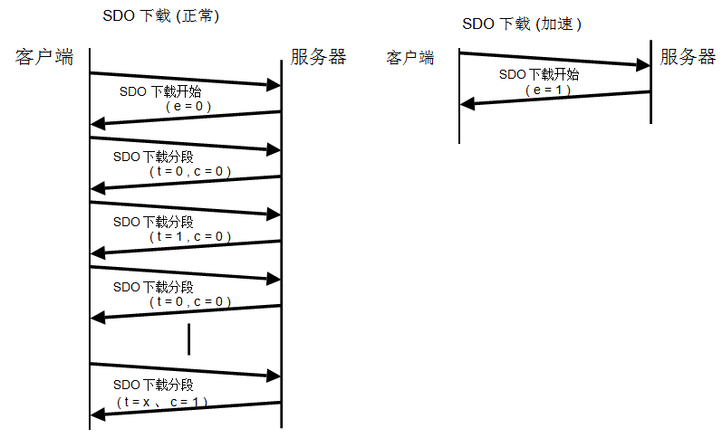
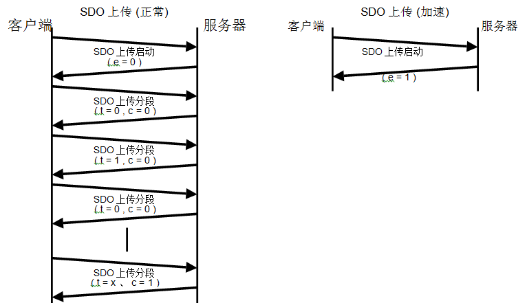
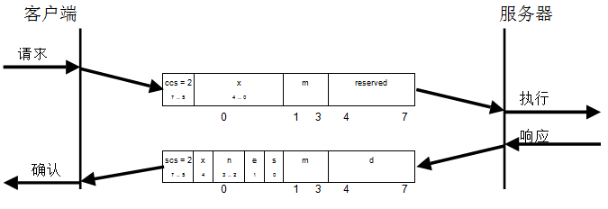
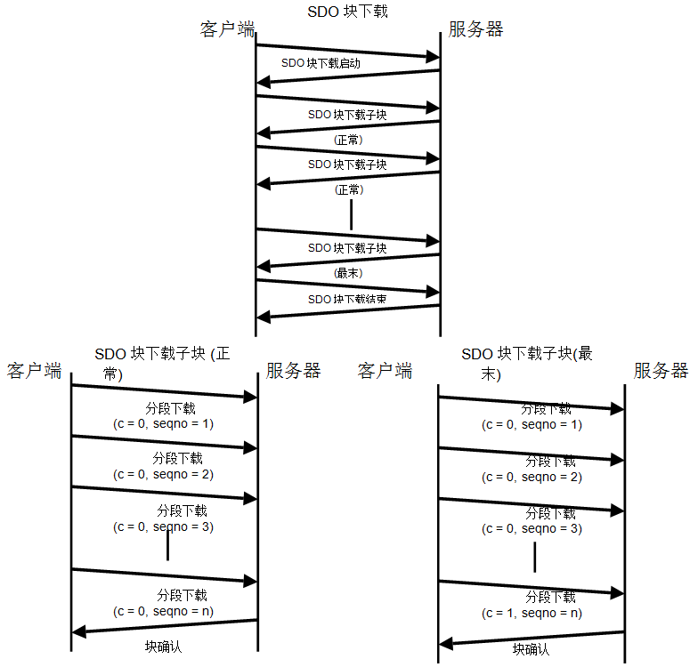
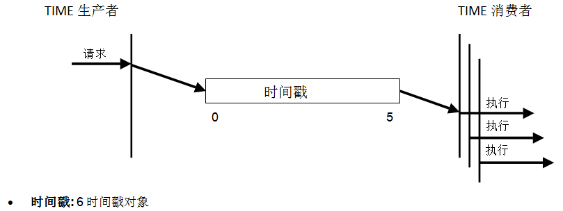
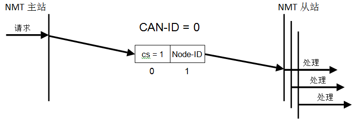
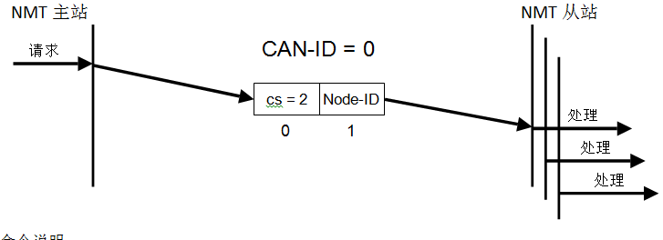
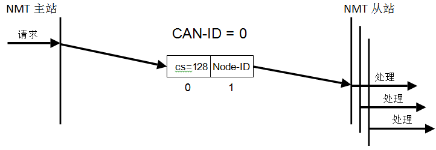
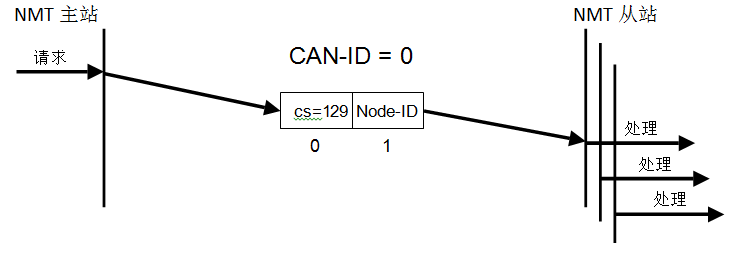

##7.2 **通信对象**
###7.2.1 **简述**
通信对象被描述为服务和协议(~~译者理解服务规定过程，协议规定格式~~)。

所有服务以表格形式给出,包含为服务定义的每个原始参数。特定的服务类型包含不同的参数（如无应答、应答等等）。

所有服务都假定CAN的数据链路层和物理层未出错。这些问题由应用程序解决因而不在本文范畴。

###7.2.2 **过程数据对象(PDO)**
####7.2.2.1 **简述**
实时的数据传输通过“过程数据对象(PDO)”完成。PDO传输无协议开销。

由对象字典提供PDO数据和配置的接口。数据字典中对应的映射结构决定了一个PDO的数据类型和映射关系。 如果CANopen设备支持可变映射PDO，则在配置过程中(见7.3.1)，可通过SDO实现对PDO在数据字典中对应的配置进行修改。

CANopen设备的PDO数量和长度可由应用规范、设备协议或应用协议指定。

PDO分两种用法，发送和接收，分别是Transmit-PDO(TPDO) 和Receive-PDO(RPDO)。支持TPDO 的CANopen设备称为PDO生产者，支持RPDO的称为PDO消费者。PDO由PDO通讯参数和PDO映射参数描述。 其数据类型结构见7.4.8。PDO通讯参数描述了PDO的通信功能。 PDO映射参数包含了PDO传输内容信息。

每个PDO的通信和映射参数都是必不可少的。其对象介绍见7.4。

设备协议中的PDO定义总会涉及CANopen设备中的1st逻辑设备。如果定义用到了2nd逻辑设备，设备协议定义的PDO编号号增加64(40h)见表3中定义。

注意：每个逻辑设备不限制PDO数量，一个只包含单个逻辑设备的CANopen设备可以有多至512个PDO。

|**CANopen设备中的逻辑设备**|**CANopen设备中的PDO编号**|**设备协议中的PDO编号**|
|---|---|---|
|1st逻辑设备|PDO number+0 (PDO1到PDO64)|PDO number (PDO1到PDO64)|
|2nd逻辑设备|PDO number+64 (PDO65到PDO128)|PDO number (PDO1到PDO64)|
|3rd逻辑设备|PDO number+128 (PDO129到PDO192)|PDO number (PDO1到PDO64)|
|4th逻辑设备|PDO number+192 (PDO193到PDO256)|PDO number (PDO1到PDO64)|
|5th逻辑设备|PDO number+256 (PDO257到PDO320)|PDO number (PDO1到PDO64)|
|6th逻辑设备|PDO number+320 (PDO321到PDO384)|PDO number (PDO1到PDO64)|
|7th逻辑设备|PDO number+384 (PDO385到PDO448)|PDO number (PDO1到PDO64)|
|8th逻辑设备|PDO number+448 (PDO449到PDO512)|PDO number (PDO1到PDO64)|

表3：PDO编号计算举例

####7.2.2.2 **传输模式**
PDO传输模式分为:
* 同步传输
* 事件驱动传输

CANopen设备的同步由同步应用定期发送同步对象(SYNC对象)来实现。SYNC对象是一个预定义的通信对象(见7.2.5)。图 16 说明了同步和事件驱动的传输原则过程。同步PDO在紧接着SYNC对象之后的同步窗中传输。

图16：同步和事件驱动的传输

PDO 传输模式由传输类型参数指定，包括出发模式。

同步TPDOs传输类型还指定了传输倍率——同步周期倍数因数。传输类型0表示消息会在触发事件后再收到SYNC（非周期）执行。1表示每个SYNC触发一次消息。n表示每隔n个SYNC触发一次消息。事件驱动的TPDOs与SYNC对象无关。

同步 RPDOs 收到数据后在随后的SYNC发生后传递给应用程序，传输类型同时指定了传输倍率。事件驱动 RPDOs 直接将数据传递给应用程序。

####7.2.2.3 **触发模式**
有三种消息触发模式分类：
- **事件和定时器驱动**
        由应用规范、设备协议、应用协议或定时(event-time)触发的消息传输。
- **远程请求**
        PDO的消费者发出一个RTR请求触发事件驱动PDO的发送。
- **同步触发**
        由一定数量的Sync和内部事件(可选)触发。

####7.2.2.4 **PDO服务**
#####7.2.2.4.1**概述**
PDO 通信遵循的生产者/消费者关系见4.4.4。
属性：

  -PDO number:    PDO编号[1..512]约束逻辑设备上的每个用户类型

  -user type:     之一{ 消费者、生产者}

  -data type:     据PDO映射

  -inhibit-time:  N*100 s,$$\mu$$N>0

#####7.2.2.4.2 **PDO写服务**
PDO写服务是推模式。可以有多个PDO消费者，也可以没有，但PDO生产者只能有一个。
通过该服务，PDO生产者发送映射好的数据给消费者(们)。用于此服务的参数被定义在表4中。

|参数|请求/执行|
|---|---|
|**要素** PDO编号 数据|**强制性** 强制 强制|

表4：PDO写

#####7.2.2.4.3 **PDO读服务**
PDO读服务是拉模式。有一位或更多的PDO消费者。但只有一个PDO生产者。

通过该服务，PDO消费者请求生产者提供映射好的数据，即远程响应。用于此服务的参数被定义在表5。

|参数|请求/执行|响应/确认|
|:---|:---|:---|
|**要素** PDO编号 **远程结果** 数据|**强制性** 强制   |  **强制性** 强制|

表5：PDO读

####7.2.2.5 **PDO协议**
7.2.2.5.1	PDO写协议
请求无确认的PDO写服务。PDO生产者将PDO过程数据发到网络上。网络上可能有0到n个PDO消费者。 在PDO消费者（们）接收到有效的PDO报文后执行相关操作。图17定义了PDO写协议。

过程数据：L字节的应用数据

图17：PDO写协议
#####7.2.2.5.2 **PDO读协议**
该PDO读服务须应答。一或多个PDO消费者发送RTR到网络上。PDO生产者收到RTR后回复相应的PDO。所有该PDO的关联消费者接收执行。 PDO消费者数量1到n个。读服务是可选的，取决于硬件条件。图18指定PDO读协议。

过程数据：L字节的应用数据

图18：PDO读协议

###7.2.3 **寻址PDO(MPDO)**
####7.2.3.1 **简述**
MPDO提供了直接访问CANopen设备对象字典的服务。限制最大4字节数据。

有两种MPDO使用方法。第一是目的地址模式(DAM)MPDO，第二是源地址模式(SAM)MPDO。支持发送MPDO 的CANopen设备称为MPDO生产者，支持接收MPDO的称为MPDO消费者。

由对象字典提供了MPDO数据和配置的接口。

MPDOs对应了在对象字典中提供接口给应用程序对象的对象。
 
####7.2.3.2 **MPDO寻址模式**
#####7.2.3.2.1 **目的地址模式(DAM)**
MPDO消费者的对象字典对象提供了寻址标识(见7.2.3.4.1)。一个DAM-MPDO可被所有该MPDO消费者同时接收，并不限于单一MPDO消费者。该写服务无应答，如果寻址对象不存在产生EMCY帧。

发送MPDO由事件驱动，不支持定时、远程请求和同步触发模式。
#####7.2.3.2.2 **源地址模式(SAM)**
MPDO寻址依赖于MPDO生产者。每个CANopen设备只允许一个此类MPDO生产者存在。发送MPDO由事件驱动，不支持定时、远程请求和同步触发模式。MPDO生产者使用一个扫描列表，以便知悉发送哪些数据对象。MPDO消费者使用分配列表，以便知悉源到目的的关联。
####7.2.3.3 **MPDO服务**
#####7.2.3.3.1 **简述**
MPDO通信遵循的生产者/消费者关系见4.4.4。

属性：

-PDO编号:       PDO编号[1..512]约束逻辑设备上的每个PDO用户类型

-User type:     之一{消费者、生产者}

-multiplexer:   其中包含索引和子索引，STRUCTURE OF UNSIGNED16，UNSIGNED8，指CANopen设备对象字典的指定对象索引和子索引号。

-address type:  之一{源、目的}

-Node-ID    消费者或生产者

-Inhibit-time:  N*100$$\mu$$s,N>0
#####7.2.3.3.2 **MPDO写服务**
MPDO写服务是推模式。可以有多个的MPDO消费者，也可以没有，但MPDO生产者只有一个。

用于此服务的参数被定义在表6。

表6：MPDO写服务

|参数|请求/执行|
|---|---|
|**要素** PDO编号 地址类型 Node-ID Multiplexer 数据|**强制性** 强制 强制 强制 强制 强制|

####7.2.3.4 **MPDO协议**
####7.2.3.4.1 **MPDO写协议**
MPDO写服务无应答。MPDO生产者发送MPDO过程数据到网络。可能是有0到n个MPDO消费者，取决于给定的node-ID。MPDO消费者(们)接收到有效的PDO应接收处理。图19指定MPDO写入协议。

图19：MPDO写协议

- **f**：地址类型
    + 0：源地址
    + 1：目的地址
- **addr**：目的寻址的MPDO消费者或源地址寻址的MPDO生产者的node-ID。
    + 0：源寻址模式下保留。在目的寻址模式下表示所有CANopen网络中接收MPDO配置为目的寻址模式的设备。
    + 1..127：CANopen网络中相应的节点node-ID。
- **m**：multiplexer。表示MPDO携带过程数据的索引/子索引号，源寻址表示发送CANopen设备数据索引和子索引，目的寻址表示接收方数据存放的索引和子索引。
- **d**：过程数据。数据长度低于4 字节比较适合32位数据。

###7.2.4 **服务数据对象(SDO)**
####7.2.4.1 **简述**
SDO提供了直接访问CANopen设备对象字典的入口。入口条件包括数据类型和大小。SDO可用于客户和服务器之间传输多个数据集（每个包含任意大小数据块）。客户端通过寻址（对象字典的索引和子索引）来控制传输哪个数据集。数据集的内容定义在对象字典中。

基本上SDO采用分段序列传输。先发送一个初始化分段，让客户端和服务器各自准备好处理接下来的分段。SDO也可以在初始化段中包含多至4字节的数据，该机制称为快速SDO传输（译注：更常用）。

作为可选功能，SDO支持块序列传输，其中每块可由多至127段（包含序号和数据）的段序列组成。先发送一个初始化块，让客户端和服务器准备好处理接下来的块，并议定每块的分段数。在传输完成阶段，客户端和服务器通过校验来验证之前接收到的数据集的正确性。上述方法称为SDO块传输，在大数据集传输上比段传输快。

SDO块上传因为有协议开销使其传输块大于数据本身大小。因此需要合理利用SDO正常(分段式)或快速传输模式。SDO块传输优于其它传输方式的最小数据集大小，取决于客户端在初始化阶段发给服务器的参数阈值。

Go-Back-n ARQ方案在SDO块传输中用于对每个块的确认:
* SDO块下载完成后，服务器向客户端确认成功收到最后一个SDO块传输分段。 执行此操作的服务器也隐含的承认之前的分段接收正常。 客户端应开始接下来的SDO块传输。此外服务器应在应答内容里明确下一SDO块的分段数。
* SDO块上传完成后，客户端向服务器确认成功收到最后一个SDO块传输分段。执行此操作的客户端也隐含承认之前的分段接收正常。服务器应开始接下来的SDO块传输。此外客户端应在应答内容里明确下一SDO块的分段数。

任何类型的SDO传输都由客户端发起。数据字典持有者是服务器。客户端或服务器都可以主动中止传输。

通过在两个CANopen设备间建立点对点的通信信道。CANopen设备可以支持多个SDO。每个设备支持一个Server-SDO作为默认项（缺省SDO）。

SDO由SDO通信参数项描述。其数据类型结构说明见7.4.8。SDO通信参数描述了SSDO和CSDO的通信功能。
每个SDO通讯参数都是必不可少的。如果只有一个SSDO存在，通信参数可以省略。上述对象描述见7.4。

####7.2.4.2 **SDO服务**
#####7.2.4.2.1 **简述**
SDO通讯模型是4.4.3节所述的客户端/服务器模型。

属性：
* -SDO编号:             本地设备的每个用户类型都有一个SDO编号[1..128]
* -用户类型:            之一 { client , server }
* -寻址数据类型:        其中包含索引和子索引，STRUCTURE OF UNSIGNED16,UNSIGNED8，指CANopen设备对象字典的指定对象索引和子索引号。
* -传输类型:            取决于数据传输长度：快速、多至4字节的正常(分段式)或块;正常 (分段式)或块超过4字节数据。
* -数据类型:            取决于索引和子索引对应的对象。

以下SDO服务由应用程序请求触发:
- SDO下载，其中分为
    + SDO下载启动
    + SDO下载分段
- SDO上传，其中分为
    + SDO上传启动
    + SDO上传分段
- SDO中止传输

SDO分段下载和上传的分段工作由通信软件（~~译注：协议栈~~）负责。
SDO快速传输应被支持。大于4字节的数据对象传输需要SDO分段传输支持。可选的SDO块传输是为了较高总线利用率传输大数据集:
- SDO块下载，其中分为
    + SDO块下载启动
    + SDO下载块
    + SDO块下载结束
- SDO块上传，其中分为
    + SDO块上传启动
    + SDO上传块
    + SDO块上传结束
    + 
使用SDO块下载和块上传服务的通信软件负责传输数据分块工作。

SDO块上传协议支持一个提高传输性能的开关。(~~译注：此段翻译不确定~~)

使用SDO 中止传输服务来中止SDO块传输。

#####7.2.4.2.2 **SDO下载服务**
客户端使用SDO下载服务向服务器(持有数据字典)传输数据。数据的索引和子索引、数据集、大小都将通知服务器。用于此服务的参数被定义在表7中。
 
该服务需要应答。远程返回的结果将会说明请求的成功或失败。失败原因是确定的。

SDO下载过程至少包括SDO下载启动，也许还会有SDO段下载服务（数据长度>4字节）。

表7：SDO下载服务

|*参数*|*请求/执行*|*响应/确认*|
|---|---|---|
|**要素** SDO编号 索引 大小 数据 **远程结果** 成功 失败 *原因*|**强制性** 强制 强制 可选 强制     |     **强制性** 选择 选择 *可选的*|

#####7.2.4.2.3 **SDO下载启动服务**
客户端使用SDO下载启动来请求服务器准备数据下载。要下载的数据大小对于服务器来说是可选的（~~注译:根据索引信息就能清楚~~）。用于此服务参数被定义在表8中。

数据集的寻址和传输类型被提供给服务器。一旦SDO下载开启，数据集的大小和寻址信息就会提交给服务器。

表8：SDO下载启动服务

|*参数*|*请求/执行*|*响应/确认*|
|---|---|---|
|**要素** SDO编号 索引 传输类型 *正常* *快速* 大小 数据 **远程结果** 成功|**强制性** 强制 强制 强制 *选择* *选择* 可选 强制   |        **强制性** 强制|

该服务带应答。远程结果将说明请求成功。如果失败，应答SDO中止传输。如果一个带索引寻址的帧成功下载，服务器会认定要下载的数据集由该寻址索引标识。 

#####7.2.4.2.4 **SDO分段下载服务**
客户端使用SDO下载服务传输分段数据给服务器。 分段数据集可选的数据大小描述将发给服务器。接下来的参数表明是否还要下载更多分段或者本段已是最后一段。用于此服务的参数被定义在表9中。

表9：SDO分段下载服务

|*参数*|*请求/执行*|*响应/确认*|
|---|---|---|
|**要素** SDO编号 持续性 *更多* *最末* 大小 数据 **远程结果** 成功|**强制性** 强制 强制 *选择* *选择* 强制 强制   |      **强制性** 强制|

该服务带应答。 远程结果参数将表明请求成功。 如果失败应发起SDO中止传输。如果成功，服务器接收该分段数据并为下一段做准备。该SDO传输应至少包含一个SDO分段。

该服务须保证之前已成功进行了带有分段传输类型信息的SDO下载启动。

#####7.2.4.2.5 **SDO上传服务**
客户端通过SDO上传服务从服务器(对象字典持有者)获取数据。数据集的索引信息会先发给服务器。用于此服务的参数被定义在表10中。

SDO上传过程至少包含SDO上传启动服务，而SDO分段上传服务(数据长度>4个字节)是可选的。

表10：SDO上传服务

|*参数*|*请求/执行*|*响应/确认*|
|---|---|---|
|**要素** SDO编号 索引 **远程结果** 成功 *大小* *数据* 失败 *原因*|**强制性** 强制 强制       |   **强制性** 选择 *可选* *强制* 选择 *可选* |

该服务带应答。远程结果将会显示请求成功或失败。如果失败，其原因作为可选项被回复。如果成功，数据及其大小作为确认返回。

#####7.2.4.2.6 **SDO上传启动服务**
客户端通过SDO上传启动服务让服务器做好数据上传准备。数据集的索引信息会发给服务器，该服务所需参数在表11中定义。
该服务带应答。远程结果将表明请求是否成功。如果失败，SDO 中止传输请求会被被执行。如果成功，数据及其大小作为应答返回。如果SDO上传启动成功，该服务中标识所要上传数据集的索引及对应的应答数据将得到确认。

表11：服务SDO上传启动

|*参数*|*请求/执行*|*响应/确认*|
|---|---|---|
|**要素** SDO编号 索引 **远程结果** 成功 *索引* *传输类型* 正常 快速 *尺寸* 数据|**强制性** 强制 强制         |   **强制性** 强制 *强制* *强制* 选择 选择 *可选* 强制|

#####7.2.4.2.7 **SDO分段上传服务**
客户端通过SDO分段上传服务向服务器请求下一个数据分段。接下来的参数向客户端表明是否还有更多分段或此为最后一个上传分段，SDO分段上传服务至少应包含一个分段。用于此服务的参数被定义在表12中。

该服务带应答。远程结果将表明请求是否成功。如果出现故障，SDO中止传输请求将被发起。如果成功，该分段的数据及其大小作为应答回复。

此服务之前应已进行过成功的SDO上传启动服务。

表12：SDO分段上传服务

|*参数*|*请求/执行*|*响应/确认*|
|---|---|---|
|**要素** SDO编号 **远程结果** 成功 *继续* 更多 最末 *尺寸* *数据*|**强制性** 强制        |  **强制性** 强制 *强制* 选择 选择 强制 强制|

#####7.2.4.2.8 **SDO块下载服务**
客户端通过块下载服务向服务器(对象字典持有者)发送数据。数据、数据集索引和可选的数据大小会被发送给服务器。用于此服务的参数被定义在表13中。

该服务带应答。远程结果将表明请求是否成功。如果失败，可选择在应答中包含原因。

表13：SDO块下载服务

|*参数*|*要求/执行*|响应/确认|
|---|---|---|
|**要素** SDO编号 索引 大小 数据 **远程结果** 成功 失败 *原因*|**强制性** 强制 强制 可选 强制     |     **强制性** 选择 选择 *可选*|
#####7.2.4.2.9 **SDO块下载启动服务**
客户端通过SDO块下载启动服务通知服务器为下载做准备。用于此服务的参数被定义在表14中。

数据集的索引和可选的数据大小信息会发给服务器。

SDO块下载结束后，客户端和服务器都有能力和需求去校验数据完整性。

表14：SDO块下载启动服务

|*参数*|*要求/执行*|*响应/确认*|
|---|---|---|
|**要素** SDO编号 CRC能力 *是* *否* 索引 大小 **远程结果** 成功 CRC能力 *是* *否* blksize|**强制性** 强制 强制 *选择* *选择* 强制 可选       |       **强制性** 强制 强制 *选择* *选择* 强制|

该服务带应答。远程结果将表明请求是否成功，服务器会收到每块的分段数和校验信息。如果失败，SDO中止传输服务将被发起。

#####7.2.4.2.10 **SDO子块下载服务**
客户端通过子块下载服务向服务器发送下一数据块。数据块由一个段列组成。每段包含相应的分段数据和从1开始到blksize的分段序号。参数blksize由客户端和服务器之间通过SDO块下载启动服务协商好，并且可以由服务器在块应答里更改。接下来的参数说明服务器会继续接收子块还是结束。用于此服务的参数被定义于表15。

表15：SDO子块下载服务

|*参数*|*要求/执行*|*响应/确认*|
|---|---|---|
|**要素** SDO编号 继续 *更多* *最末* 数据 **远程结果** 成功 *Ackseq* *Blksize*|**强制性** 强制 强制 *选择* *选择* 强制     |**强制性** 强制 *强制* *强制*|
该服务带应答。远程结果将表明请求是否成功。如果成功，ackseq参数表明服务器成功接收的最后一段的段号。如果和客户端发送的最后一段的段号对应不上，则客户端会在下一次块传输时重传所有被服务器丢弃的段。如果出现致命错误，SDO中止传输服务会被发起。如果服务器收到并确认所有数据段则进行下一块的接收准备。SDO块下载应至少包含一个SDO块下载子块服务。

此服务之前需要一次成功的SDO块下载启动服务。

#####7.2.4.2.11 **SDO块下载结束服务**
客户端通过SDO块下载结束服务来结束与服务器的合作。最后传给服务器的分段字节里面并不包含有效数据。用于此服务的参数被定义在表16中。

客户端和服务器都有能力和需求对传输的数据进行校验。

表16：SDO块下载结束服务

|*参数*|*请求/执行*|*响应/确认*|
|---|---|---|
|**要素** SDO编号 Valid_data 校验和  **远程结果** 成功|**强制性** 强制 强制 条件的， 如果议定则强制   |     **强制性** 强制|

该服务带应答。 远程结果将表明请求是否成功(客户端和服务器之间议定的话需校验和相匹配)，下载数据集是否有效。如果失败，SDO中止传输服务将被发起。
#####7.2.4.2.12 **SDO块上传服务**
客户端通过SDO块上传服务向服务器（持有数据字典）请求数据。请求的数据集索引会发给服务器。 用于此服务的参数被定义在表17中。

该服务带应答。远程结果将会表明请求是否成功。如果失败了，应答信息里可包含失败原因。如果成功了，将返回数据及其可选的大小。

表17：服务SDO块上传

|*参数*|*请求/执行*|*响应/确认*|
|---|---|---|
|**要素** SDO编号 索引 **远程结果** 成功 *大小* *数据* 失败 *原因*|**强制性** 强制 强制       |   **强制性** 选择 *可选的* *强制* 选择 *可选的*|

7.2.4.2.13SDO块上传启动服务
客户端通过该服务通知服务器准备好数据上传。启动上传的索引和有能力接收的段数会报给服务器。 用于此服务的参数被定义在表18中。
一项阈值切换协议会发给服务器。如果上传的字节数小于或等于该值，服务器会以7.2.4.2.5描述的SDO上传服务应答。客户端和服务器都有保证传输完整的校验能力和需求。可选的上传数据尺寸信息也会发给客户端。

表18：服务SDO块上传启动

|*参数*|*请求/执行*|*响应/确认*|
|---|---|---|
|**要素** SDO编号 Blksize CRC能力 *是* *否* 索引 阈值 **远程结果** 成功 *CRC能力* ***是*** ***否*** *大小*|**强制性** 强制 强制 强制 *选择* *选择* 强制 强制       |        **强制性** 强制 *强制* ***选择*** ***选择*** *可选的*|
该服务带应答。如果失败，SDO传输中止服务被发起。如果成功，可选的数据大小信息会发给客户端。

##### 7.2.4.2.14 **SDO块上传子块服务**
该项服务是由之前的SDO上传启动服务或前一次的SDO子块上传服务的客户端发起。服务器使用该服务将分块数据发给客户端。该块数据以分段序列的形式传输。每段包含相应的分段数据和从1开始到blksize的分段序号。参数 blksize由客户端和服务器之间通过SDO块上传启动服务协商好，并且可以由客户端在块应答里更改。接下来的参数表明客户端会继续接收子块还是结束。用于此服务的参数被定义在表19中。

表19：SDO子块上传服务

|*参数*|*请求/执行*|*响应/确认*|
|---|---|---|
|**要素** SDO编号 继续 *更多* *最后* 数据 **远程结果** 成功 *Ackseq* *Blksize*|**强制性** 强制 强制 *选择* *选择* 强制     |      **强制性** 强制 *强制* *强制*|

该服务带应答。远程结果参数将表明请求是否成功。如果成功，ackseq 参数表明客户端成功接收的最后一段的段号。如果和服务器发送的最后一段的段号对应不上，服务器会在下一次块传输时重传所有被客户端丢弃的段。如果出现致命错误，SDO中止传输服务会被发起。如果客户端收到并确认所有数据段则进行下一块的接收准备。SDO块上传应至少包含一个SDO块上传子块服务。
此服务之前需要一次成功的SDO块上传启动服务。

#####7.2.4.2.15 **SDO块上传结束服务**
服务器通过SDO块上传结束服务来结束与客户端的合作。最后传给客户端的分段字节里面并不包含有效数据。用于此服务的参数被定义在表20中。

客户端和服务器都有能力和需求对传输的数据进行校验。

表20：SDO块上传结束服务

|*参数*|*请求/执行*|*响应/确认*|
|---|---|---|
|**要素** SDO编号 Valid_data 校验和 **远程结果** 成功|**强制性** 强制 强制 议定则强制   |    **强制性** 强制|
该服务带确认。远程结果将表明明请求是否成功(客户端和服务器之间议定的话需校验和相匹配)，下载数据集是否有效。如果失败，SDO中止传输服务将被发起。

#####7.2.4.2.16 **SDO中止传输服务**
该服务能够中止SDO上传和下载服务，并列出原因。该服务无应答。客户端和服务器在任何时候都可以发起该服务。如果SDO客户端得到了一个明显确认，就会向服务器发送中止服务的确认，用于此服务的参数被定义在表21中。

表21：SDO中止传输服务

|*参数*|*请求/说明*|
|---|---|
|**要素** SDO编号 索引 原因|**强制性** 强制 强制 强制|

####7.2.4.3 **SDO协议**
#####7.2.4.3.1 **简述**
SDO一共定义了六种带应答的服务（SDO下载，SDO上传，SDO上传启动，SDO下载启动，SDO分段下载和SDO分段上传）和一种不带应答的服务（SDO中止传输），它们共同作用来进行SDO正常（分段）传输和加速传输。

SDO一共定义了八种带应答的服务（SDO块下载，SDO块上传，SDO块上传启动，SDO块下载启动，SDO子块下载，SDO子块上传，SDO块上传结束和SDO块下载结束）和一种不带应答的服务（SDO中止传输），它们共同作用来进行SDO块传输。

#####7.2.4.3.2 *SDO下载协议*

图20：SDO下载协议

该协议（如图20）为SDO下载服务，由SDO下载启动服务开始，接着是0或多个SDO分段下载服务组成的序列。该序列的终止条件如下：
* SDO下载启动请求/执行对应返回一个应答/确认，其e-bit被置1，表明成功完成一次加速下载。
* SDO分段下载的响应/确认帧c-bit被置1，表示成功的完成了一次正常下载。
* SDO中止传输请求/执行，表明下载过程未成功。
* 新的SDO下载启动请求/执行，说明下载序列还没完成就新开一个下载序列。

如果下载过程中，相邻两个分段的翻转位没有变化。后一分段将被忽略。如果该种错误被汇报到应用程序，应用程序可以决定是否需要中止下载。
#####7.2.4.3.3 **SDO下载启动协议**
SDO下载启动协议执行过程如图21所示。

- ccs：客户端命令说明符
    + 1：下载启动请求
- scs：服务器命令说明符
    + 3：下载启动的响应
- n：有效仅当e = 1,s = 1,否则为0。如果有效的话，它表示d中不带数据的字节数。字节[8-n，7] 不包含数据。
- e：传输类型
    + 0：正常的传输
    + 1：快速传输
- s：大小说明
    + 0：数据集的大小不指明
    + 1：数据集的大小明确指出
- m：索引。表示传输数据的索引/子索引号。
- d：数据
    + e = 0、s = 0：d预留以供将来使用。
    + e = 0、s = 1：d 包含下载字节。Byte4为LSB，Byte7为MSB。
    + e = 1、s = 1：d包含下载的长度4-n的数据，编码取决于索引和子索引对应数据的类型。
    + e = 1、s = 0：d包含下载的未指定字节数的数据。
- x：不使用，始终为0
- reserved：为将来保留，始终为0

图21：SDO下载启动协议

#####7.2.4.3.4 **SDO分段下载协议**
该协议定义在图22中。

- ccs：客户端命令说明
    + 0：分段下载请求
- scs：服务器命令说明
    + 1：分段下载的响应
- seg-data：最多7字节的分段数据。编码取决于索引和子索引对应的数据类型。
- n：seg-data中不包含分段数据的字节数。[8-n，7]为不包含分段数据的空字节。如果n = 0则1到7字节填满。

    注意：如果该字节数即是启动服务中所明确的长度，则该分段包含所有需要传输的数据。
- c：表明是否还有要下载的分段。
    + 0：更多的分段需要被下载
    + 1：没有更多的分段需要被下载
- t：翻转位。每个下载分段中翻转一次。第一个分段翻转位置0。该位应与对应的应答一致。
- x：不使用，始终为0。
- reserved：为将来保留，始终为0。

图22：SDO分段下载协议

#####7.2.4.3.5 **SDO上传协议**

图23：SDO上传协议

该协议（如图23）为SDO上传服务，由SDO上传启动服务开始，接着是0或多个SDO分段上传服务组成的序列。该序列的终止条件如下：
* SDO上传启动请求/执行对应返回一个应答/确认，其e-bit被置1，表明成功完成一次加速上传。
* SDO分段上传的响应/确认帧c-bit被置1，表示成功的完成了一次正常上传。
* SDO中止传输请求/执行，表明上传过程未成功。
* 新的SDO上传启动请求/执行，说明上传序列还没完成就新开一个下载序列。

如果上传过程中，相邻两个分段的翻转位没有变化。后一分段将被忽略。如果该种错误被汇报到应用程序，应用程序可以决定是否需要中止上传。

#####7.2.4.3.6 **SDO上传启动协议**

SDO上传启动协议执行过程如图24所示。

- ccs：客户端命令说明
    + 2：上传开始请求
- scs：服务器命令说明
    + 2：上传开始响应
- n：仅当e = 1，s = 1时有效, 否则为0。如果有效的话,表示d中不包含数据的字节数。字节[8-n， 7]中不带数据。
- e：传输类型
    + 0：常的传输
    + 1：加速传输
- s：大小说明
    + 0：数据集的大小不明确指定
    + 1：数据集的大小明确说明
- m：索引。表示SDO传输数据对应的索引/子索引号。
- d：数据
    + e = 0、s = 0：为将来预留。
    + e = 0、s = 1：d包含上传的字节数。Byte4为lsb，Byte7为msb。
    + e = 1、s = 1：d中包含长度4-n的上传数据，编码取决于索引和子索引引用数据的类型。
    + e = 1、s = 0：d包含未指定字节长度的数据上传。
- x：不使用，始终为0。
- reserved：为将来保留，始终为0。

图24：SDO上传启动协议

#####7.2.4.3.7 **SDO分段上传协议**
该协议定义在图25 中。

- ccs：客户端命令说明
    + 3：分段上传请求
- scs：服务器命令说明
    + 0：分段上传响应
- t：翻转位。每个上传分段中翻转一次。第一个分段翻转位置0。该位应与对应的应答一致。
- c：指示是否还有更多的上传分段。
    + 0：更多上传分段 
    + 1：最后一段
- seg-data：最多7字节的上传分段数据。编码取决于索引和子索引指向的数据的类型。
- n：不包含分段数据的字节数。字节[8-n，7]不包含分段数据。如果n = 0，字节1到7应填满分段数据。

    注意：如果该字节数即是启动服务中所明确的长度，则该分段包含所有需要传输的数据。
- x：不使用，始终为0。
- reserved：为将来保留, 始终为0。

图25：SDO分段上传协议

#####7.2.4.3.8 **SDO块下载协议**

图26：SDO块下载协议

该协议定义如图26，以块下载启动服务开始，然后是一个SDO子块下载服务序列。其序列终结条件如下：
- 块分段内的c-bit为1，表明序列顺利完成。
- SDO中止传输请求/指示，表明序列下载过程不成功。

块下载服务以块下载结束服务终止。客户端和服务器都有CRC校验能力，如果服务器校验接收数据与客户端的校验值不一致，则发起SDO中止传输。
#####7.2.4.3.9 **SDO块下载启动协议**
该协议定义于图27。

- ccs：客户端命令说明
    + 6：块下载
- scs：服务器命令说明
    + 5：块下载
- s：大小说明
    + 0：不指明数据集大小
    + 1：明确数据集大小
- cs：客户端子命令
    + 0：下载启动请求
- ss：服务器子命令
    + 0：下载启动应答
- cc：客户端CRC支持情况
    + cc = 0：不支持
    + cc = 1：支持
- sc：服务器CRC支持情况
    + sc = 0：不支持
    + sc = 1：支持
- m：索引。SDO所传输数据索引/子索引。
- size：下载字节数
    + s = 0：为将来保留,总是0。
    + s = 1：size表达要下载的字节数Byte4为LSB，byte7为MSB。
- blksize：每块的段数，0< blksize < 128
- x：未使用，总为0。
- reserved：为将来预留，总为0。

图27：SDO块下载启动协议
#####7.2.4.3.10 **SDO子块下载协议**
该协议定义于图28。

- scs：服务器命令说明
    + 5：块下载
- ss：服务器子命令
    + 2：块下载应答
- c：更多分段需要下载的标志
    + 0：更多
    + 1：没有了，进入块下载结束阶段。
- seqno：分段序号0 < seqno < 128。
- seg-data：至多7字节的分段数据。
- ackseq：成功接收的最近一块的最近一段的序列号。如果被服务器置0，表示客户端发送的序列号为1的分段未成功接收，所有分段需要重发。（~~译注：不确定~~）
- blksize：每块的段数，0< blksize <128。
- x：未使用，总为0。
- reserved：预留，总为0。

图28：SDO子块下载协议

#####7.2.4.3.11 **SDO块下载结束协议**
该协议定义于图29。

- ccs：客户端命令说明
    + 6：块下栽
- scs：服务器命令说明
    + 5：块下载
- cs：客户端子命令
    + 1：块下载结束请求
- ss：服务器子命令
    + 1：块下载结束请求应答
- n：最近一块的最近一段不包含数据的字节数。Bytes[8-n,7]不包含分段数据。
- crc：数据集的16位循环冗余校验(CRC)。CRC算法见7.2.4.3.16。仅当SDO块下载启动中cc和sc被置1时CRC有效，否则CRC置0。
- x：未使用，总为0。
- reserved：预留，总为0。

图29：SDO块下载结束协议
#####7.2.4.3.12 **PDO块上传协议**
 

图30：SDO块上传协议

该协议定义如图30，以块上传启动服务开始，客户端发给服务器使用SDO块上传服务代替SDO上传服务所需最小字节数阈值。如果数据集字节数小于等于该阈值则使用常规的SDO上传服务。
另一方面，块上传是以SDO块上传子块序列形式呈现，其序列终结条件如下：
- 块上传分段内的c-bit为1，表明序列顺利完成。
- SDO中止传输请求/指示，表明序列下载过程不成功。

块下载服务以块下载结束服务终止。客户端和服务器都有CRC校验能力，如果客户端校验接收数据与服务器的校验值不一致，则发起SDO中止传输。
#####7.2.4.3.13 **SDO块上传启动协议**
该协议定义于图31。如果客户端请求的数据集字节数小于等于其发送的第一个请求中的协议切换阈值，则启用定义于7.2.4.3.5的常规SDO上传服务。

- ccs：客户端命令说明
    + 5：块上传
- scs：服务器命令说明
    + 6：块上传
- cs：客户端子命令
    + 0：启动上传请求
    + 3：开始上传
- ss：服务器子命令
    + 0：启动上传响应
- m：索引。它代表传输的SDO数据对应的索引/子索引。
- cc：客户端是否支持CRC
    + cc = 0：客户端不支持生成数据CRC
    + cc = 1：客户端支持生成数据CRC 
- sc：服务器是否支持CRC
    + sc = 0：服务器不支持生成数据CRC 
    + sc = 1：服务器支持生成数据CRC 
- pst：根据切换阈值确定数据传输协议
    + pst = 0：	不允许切换传输协议。
    + pst > 0：如果数据大小小于或等于pst,服务器将以7.2.4.3.5所述SDO上传服务来响应。
- s：尺寸指示
    + 0：数据集的大小不指明。
    + 1：数据集的大小明确。
- size：以字节为单位的上传数据大小
    + s =  0：保留，始终为0。
    + s = 1：上传(译注：原文有误，写成了downloaded)的数据字节数Byte4为lsb，Byte7为msb。
- blksize：每块分段数 0 < blksize < 128。
- x：不使用，始终为0。
- reserved：为将来保留，始终为0。

图31：SDO块上传启动协议
#####7.2.4.3.14 **SDO子块上传协议**
该协议定义于图32。
.4.3.5的常规SDO上传服务。

- ccs：客户端命令说明
    + 5：块上传
- cs：客户端子命令
    + 2：块上传响应
- c：是否还有更多上传(译注：原文为downloaded)分段
    + 0：更多上传分段 
    + 1：没有更多的上传分段，进入“结束块上传”的阶段。
- seqno：段序列编号 0 < seqno < 128 。
- seg-data：多至7字节的上传分段数据。
- ackseq：成功接收的最近一块的最近一段的序列号。如果被客户端置0，表示服务器发送的序列号为1的分段未成功接收，所有分段需要重发。（~~译注：不确定~~）
- blksize：每块的段数， 0 < blksize < 128。
- x：不使用，始终为0。
- reserved：为将来保留，始终为0。

图32：SDO子块上传协议
#####7.2.4.3.15 **SDO块上传结束协议**
该协议定义于图33。

- ccs：客户端命令说明
    + 5：块上传
- scs：服务器命令说明
    + 6：块上传
- cs：客户端子命令
    + 1：结束块上传请求
- ss：服务器子命令
    + 1：结束块上传响应
- n：最近一块的最近一段不包含数据的字节数。Bytes[8-n，7]不包含分段数据。
- crc：数据集的16位循环冗余校验(CRC)。CRC算法见7.2.4.3.16.仅当SDO块上传启动中cc和sc被置1时CRC有效，否则CRC置0。
- x：未使用，总为0。
- reserved：预留，总为 0。

图33：SDO块上传结束协议

7.2.4.3.16	验证SDO块传输的CRC算法
要验证交换数据的正确性，客户端和服务器须在SDO块上传和下载服务的结束协议中体现CRC计算。 CRC校验应具有以下参数：

—	CRC多项式：	X16+ x12+ x5+ 1

—	CRC宽度：	16位

—	初始值：	0000h

—	CRC检查(123456789的CRC结果)：         31C3H
#####7.2.4.3.17 **SDO中止传输协议**
该协议定义于图34。

- cs：命令说明符
    + 4：中止传输请求
- x：不使用，始终为0。
- m：索引。SDO索引和子索引。
- d：包含4字节的中止原因代码。

图34：SDO中止传输协议

中止代码定义于表22被编码为UNSIGNED32。

表22：SDO中止代码

|**中止代码**|**描述**|
|---|---|
|0503 0000h|翻转位未变化|
|0504 0000h|SDO协议超时|
|0504 0001h|客户端/服务器命令说明无效或未知|
|0504 0002h|无效的块大小(仅块模式)|
|0504 0003h|无效的序列号(仅块模式)|
|0504 0004h|CRC错误(仅块模式) |
|0504 0005h|内存不足|
|0601 0000h|不支持的访问的对象|
|0601 0001h|试图读取只写的对象|
|0601 0002h|尝试写入只读对象|
|0602 0000h|对象不存在于对象字典|
|0604 0041h|对象不能被映射进PDO。|
|0604 0042h|对象长度和数量超出PDO的长度|
|0604 0043h|常规参数不兼容的原因|
|0604 0047h|设备内部不兼容|
|0606 0000h|硬件错误导致的访问失败|
|0607 0010h|数据类型不匹配，服务长度参数不匹配。|
|0607 0012h|数据类型不匹配，服务长度参数太大|
|0607 0013h|数据类型不匹配，服务长度参数太小|
|0609 0011h|子索引不存在|
|0609 0030h|无效的参数值(仅下载)|
|**中止代码**|**描述**|
|0609 0031h|写入参数值太高 ( 仅下载 ) 。|
|0609 0032h|写入参数值太低 ( 仅下载 ) 。|
|0609 0036h|最大值小于最小值|
|060A 0023h|资源不可用：SDO连接|
|0800 0000h|常规错误|
|0800 0020h|数据不能传输或保存到应用程序。|
|0800 0021h|数据不能传输或保存应用程序，由于本地的控制。|
|0800 0022h|数据不能传输或保存到应用程序，因为设备当前状态。|
|0800 0023h|对象字典的动态生成失败或无对象字典的存在（例如对象字典是从文件生成，而由于文件的错误生成失败）|
|0800 0024h|无可用数据|

未列出的中止代码应保留。

###7.2.5 **同步对象(SYNC)**
####7.2.5.1 **简述**
同步生产者定期广播同步对象。SYNC提供基本的网络同步机制。SYNC周期由标准通信循环周期参数定义(见7.5.2.6)，可由配置工具在CANopen设备引导过程中写入。由于有优先级高于SYNC的通信，SYNC生产者在发送报文时可能会产生延时抖动。SYNC消费者可以使用制造商指定的通信循环周期。  
使用可选的计数器参数，可以在当前SYNC循环和PDO通信之间建立显式关系(PDO通信参数：SYNC启动值，详见7.5.2.37)。  
为了保证及时的网络访问，SYNC的CAN-ID优先级较高(见7.5.2.5)。CANopen设备通过同步操作来同步自身与同步对象生产者。详细内容由具体应用来实现，不属于本文范围。

####7.2.5.2 **SYNC服务**
#####7.2.5.2.1 **简述**

同步传输遵守生产者/消费者推送模型见4.4.4。该服务无应答。  
**属性**：
* -用户类型：   之一{消费者、生产者}
* -数据类型：   UNSIGNED8

#####7.2.5.2.2 **同步写服务**
推送模型适用于同步写入服务。SYNC消费者数量可以是零至多个，但生产者只有一个。用于定义此服务的参数见表23。  
通过该服务，SYNC生产者发送触发信号给消费者（们）。

表23：同步写服务

|*参数*|*请求/说明*|
|---|---|
|**要素** 计数器|**强制性** 可选|
该服务无应答。每次传输增1的计数器参数可选，最大值是当前的同步计数溢出值(见7.5.2.22)。一旦达到最大值，计数器在下一次传输时置1。在 NMTboot-up服务后计数器置初值1，对应的计数器也被重置为1。如果CANopen设备的状态由NMT停止(stopped)进入NMT配置(pre-operational)，计数器值应复位为1。
####7.2.5.3 **同步协议**
#####7.2.5.3.1 **同步写协议**
此协议定义如图35。

图35:同步写协议 
###7.2.6 **时间戳对象(TIME)**
####7.2.6.1 **简述**
TIME生产者广播时间戳对象。TIME提供了简单的网络时钟。由于高于TIME的通信对象的存在，TIME的发送可能会产生延迟抖动。  
为了保证及时地访问网络，TIME的CAN-ID优先级较高(见7.5.2.15)。CANopen设备通过时间戳对象生产者的TIME对象校准本地时间。详细机制不属于本规范的范围。  
####7.2.6.2 **TIME服务**
#####7.2.6.2.1 **简述**
时间戳对象遵守生产者/消费者模型，见4.4.4。该服务无应答。  
属性：
* -用户类型：   之一 {消费者、生产者}
* -数据类型：   TIME_OF_DAY

#####7.2.6.2.2 **TIME写服务**
推送模型适用于TIME写。有零至多个消费者，但生产者只有一个。用于定义此服务的参数列于表24。  
通过该服务，生产者发送当前的时间给消费者。  

表24： TIME写服务  

|*参数*|*请求/说明*|
|---|---|
|**要素** 数据|**强制性** 强制|  
该服务无应答。
####7.2.6.3 **TIME协议**
#####7.2.6.3.1 **TIME写协议**
此协议定义于图36。

图36：TIME写协议

###7.2.7 **应急对象(EMCY)**
####7.2.7.1 **应急对象的使用**
应急对象由CANopen设备的内部错误触发并且由CANopen设备应急生产者对象负责发起。应急对象适合中断类型的错误报警。一个“错误事件”仅触发一次应急对象通信。CANopen设备无新错误不会再产生应急对象。  
零至多个应急消费者可以接收应急对象。应急消费者的行为不在本文范围。  
本规范定义了应急错误码分类(表25)、应急错误代码(表26)和错误寄存器(见7.5.2.2)。由具体应用定义的附加错误信息（低字节错误码）和应急条件不在本文范围。附加错误码由其他协议规范定义。  

表25：应急错误代码分类

|**错误代码**|**描述**|
|---|---|
|00 xxh|错误复位或没有错误|
|10 xxh|常规错误|
|20 xxh|当前的|
|21 xxh|当前，CANopen设备输入侧|
|22 xxh|当前CANopen设备内部|
|23 xxh|当前，CANopen设备输出端|
|30 xxh|电压|
|31 xxh|主供电电压|
|32 xxh|CANopen设备内部电压|
|33 xxh|输出电压|
|40 xxh|温度|
|41 xxh|环境温度|
|42 xxh|CANopen设备温度|
|50 xxh|CANopen设备硬件|
|60 xxh|CANopen设备软件|
|**错误代码**|**描述**|
|61 xxh|内部软件|
|62 xxh|用户软件|
|63 xxh|数据集|
|70 xxh|附加模块|
|80 xxh|监控|
|81 xxh|通讯|
|82 xxh|协议错误|
|90 xxh|外部错误|
|F0 xxh|附加功能|
|FF xxh|CANopen设备规范|

表26：应急错误代码

|**错误代码**|**描述**|
|---|---|
|0000h|错误复位或没有错误|
|1000h|常规错误|
|2000h|当前–常规错误。|
|2100h|当前，CANopen设备输入端–常规|
|2200h|当前CANopen设备内部–常规|
|2300h|当前，CANopen设备输出端–常规|
|3000h|电压–常规错误|
|3100h|主供电电压–常规|
|3200h|CANopen设备内部电压–常规|
|3300h|输出电压–常规|
|4000h|温度–常规错误。|
|4100h|环境温度–常规|
|4200h|设备温度–常规|
|5000h|CANopen设备硬件–常规错误|
|6000h|CANopen设备软件–常规错误|
|6100h|内部软件–常规|
|6200h|用户软件–常规|
|6300h|数据集–常规|
|7000h|附加模块–常规的错误。|
|8000h|监测–常规错误|
|8100h|通信–常规|
|8110h|CAN溢出(对象丢失)|
|8120h|CAN被动模式错误|
|8130h|节点保护错误或者心跳错误|
|8140h|从总线关闭恢复|
|8150h|CAN-ID冲突|
|**错误代码**|**描述**|
|8200h|协议错误–常规|
|8210h|PDO由于长度错误不能处理|
|8220h|PDO的长度超了|
|8230h|DAM MPDO不能被处理，目标对象不可用|
|8240h|意外的SYNC数据长度|
|8250h|RPDO超时|
|9000h|外部错误–常规错误。|
|F000h|附加功能–常规错误。|
|FF00h|特定于设备–常规错误。|

应急对象是可选实现的。如果CANopen设备支持应急对象，它应支持至少2个错误代码0000h和1000h。其他所有错误代码都是可选的。  
CANopen 设备应处于两个应急状态之一(图37)。其转换取决于应急对象通信过程。错误状态与NMT状态机之间的关联由对象1029h定义(见7.5.2.32)。  
1. 初始化后CANopen设备如果未检测到错误进入无错误状态。不发送错误消息。
2. 在CANopen设备检测到内部错误，并将错误载入应急报文的前三个字节(错误代码和错误寄存器)。CANopen设备进入错误状态。发送带有相应错误代码和错误寄存器的应急对象。同时错误代码被填入本地对象1003h(预定义错误域)。
3. 一个而非所有的错误原因消失了。包含错误代码0000h(错误复位)的应急报文连同剩余的在设备指定错误域和错误寄存器中登记的错误被发送。
4. CANopen设备产生了新的错误。CANopen设备仍然在错误状态，发送带有对应错误码的应急对象。新的错误代码写入错误代码数组顶部(1003h)。保证错误码按时间排序(最早的错误-最高子索引，见对象1003h)。
5. 所有错误被修复。CANopen设备进入无错误状态，发送一个带有错误代码“错误复位/无错误”的应急对象。
6. 重启或关闭电源。

图37: 应急状态转换图

####7.2.7.2 **应急的对象服务**
#####7.2.7.2.1 **简述**
应急对象通信遵守的生产者/消费者模型详见4.4.4。该服务无应答。  
下面是对象属性说明：  
* -用户类型：   之一{消费者、生产者}
* -数据类型：   结构体
    + UNSIGNED16    应急错误代码
    + UNSIGNED8	错误寄存器
    + ARRAY (5) of UNSIGNED8	制造商指定错误域
* -抑制时间：   N * 100$$\mu$$s，N>0

#####7.2.7.2.2 **EMCY写服务**
EMCY写服务是推送模型。有零至多个消费者，而 EMCY生产者只有一个。用于定义此服务的参数见表27。  
通过该服务EMCY生产者将当前的应急数据发送给消费者（们）。  

表27：EMCY写服务

|*参数*|*请求/说明*|
|---|---|
|**要素** 数据|**强制性** 强制|

该服务无应答。

####7.2.7.3 **应急对象协议**
#####7.2.7.3.1 **EMCY写协议**
此协议定义于图38。

* eec: 应急错误码 (见表26)
* er: 错误寄存器(见对象1001h)
* msef: 制造商定义错误码

图38：EMCY写协议

不允许通过RTR触发应急报文。收到RTR将不予应答。

###7.2.8 **网络管理**
####7.2.8.1 **简述**
CANopen设备网络管理(NMT)为主从结构模型。NMT对象用于执行NMT服务。通过NMT服务，CANopen设备才能够执行初始化、启动、监控、复位或停止等行为。所有的CANopen设备被视为NMT从站。NMT从站使用node-ID标识其身份，取值范围[1..127]。  
网络中要有一个CANopen设备满足NMT主站功能需求。
####7.2.8.2 **NMT服务**
#####7.2.8.2.1 **节点控制服务** 
######7.2.8.2.1.1 **简述**
通过节点控制服务，NMT主站控制NMT从站状态。NMT状态值{停止、配置、操作、初始化}。节点控制服务可以操作单个CANopen设备或同时针对所有CANopen设备。NMT主站状态由本地服务控制。节点控制服务可由本地应用程序初始化。
######7.2.8.2.1.2 **启动远程节点服务**
NMT主站通过NMT服务启动远程节点，从而更改所选NMT从站状态。新状态应为运行态。用于此服务的参数被定义于表28。

表28：启动远程节点服务

|*参数*|*说明/要求*|
|---|---|
|**要素** Node-ID 所有|**强制性** 选择 选择|

该服务无应答，而且是强制支持的。
######7.2.8.2.1.3 **停止远程节点服务**
NMT主站通过NMT服务停止远程节点，从而更改所选NMT从站状态。新状态应为停止态。用于此服务的参数被定义于表29。

表29：停止远程节点服务

|*参数*|*说明/要求*|
|---|---|
|**要素** Node-ID 所有|**强制性** 选择 选择|

该服务无应答，而且是强制支持的。
 
######7.2.8.2.1.4 **进入配置服务**
NMT主站通过NMT服务使远程节点进入配置态，从而更改所选NMT从站状态。新状态应为配置态。用于此服务的参数被定义于表30。

表30：进入配置服务

|*参数*|*说明/要求*|
|---|---|
|**要素** Node-ID 所有|**强制性** 选择 选择|

该服务无应答，而且是强制支持的。
######7.2.8.2.1.5 **复位节点服务**
NMT主站通过NMT服务复位远程节点，从而更改所选NMT从站状态。新状态应为NMT子状态-复位应用。用于此服务的参数被定义于表31。

表31：复位远程节点服务

|*参数*|*说明/要求*|
|---|---|
|**要素** Node-ID 所有|**强制性** 选择 选择|

该服务无应答，而且是强制支持的。
######7.2.8.2.1.6 **复位通信服务**
NMT主站通过NMT服务复位远程节点通信部分，从而更改所选NMT从站状态。 新状态应为NMT子状态-复位通信。用于此服务的参数被定义于表32。

表32：复位通信服务

|*参数*|*说明/要求*|
|---|---|
|**要素** Node-ID 所有|**强制性** 选择 选择|

该服务无应答，而且是强制支持的。

#####7.2.8.2.2 **错误控制服务**
错误控制服务用于检测CAN网络内出现的故障。  
CANopen设备的本地错误可能导致复位或状态变化。具体本地错误的定义不属于本规格的范围。  
错误控制服务主要是CANopen设备通过定期发送消息实现的。有两种错误控制方法可用。  
NMT主站发送监护请求（节点监护协议：node guarding protocol），如果NMT从站没有在规定的时间跨度内(节点生存周期：node life time)回应或NMT从站的通讯状态发生变化，NMT主站会向应用程序通报相关事件。  
如果支持生存监护(NMT从站保护主站)，NMT从站由数据字典中的监护周期（guard time）和生存周期因子(life time factor)决定自身节点生存周期(lifetime)。如果在生存周期内没收到监护请求，NMT从站将此事件报告本地应用程序。如果监护周期和生存周期因子都是是0 (默认值)，NMT从站将不会监护主站。  
接收到第一帧带有监护CAN-ID的RTR意味着NMT从站的监护开始。此时可能出在启动阶段或稍后。  
心跳机制，主要内容是CANopen设备的心跳(heartbeat)生产者周期性的发送心跳消息，一或多个CANopen网络中的设备接收这一心跳消息。如果心跳生产者出现停跳，其消费者会上报该事件。  
监护或心跳都是强制性的。

备注：虽然心跳和保护默认都是禁用的，但仍然推荐使用错误控制机制。

######7.2.8.2.2.1 **节点监护事件服务**
通过该服务，NMT主站能够知悉node-ID标识的远程设备产生或解决错误。用于此服务的参数被定义于表33。
事件得到解决的说明：  
* 由于状态切换导致的事件，在收到期望的状态后，或
* 由于超时引起的事件，在得到后续的远程确认后。

表33：节点监护事件服务

|*参数*|*执行|
|---|---|
|**要素** Node-ID 状态 *发生* *解决* 原因 *超时* *状态更改*|**强制性** 强制 强制 *选择* *选择* 可选的 *选择* *选择*|

该服务在初始化和运行态提供。

######7.2.8.2.2.2 **生存监护事件服务**
通过该服务，NMT从站能够获知远程错误的发生和解决。用于此服务的参数被定义于表34。  
事件的解决由事件发生后续的远程请求来表达。 

表34：生存监护事件服务

|*参数*|*执行*|
|---|---|
|**要素** 状态 *发生* *解决*|**强制性** 强制 *选择* *选择*|

该服务由提供者发起并且是可选的功能。

######7.2.8.2.2.3 **心跳事件服务**
通过该服务，心跳消费者能够获悉node-ID标识的CANopen设备发生错误、得到解决或NMT状态切换。用于此服务的参数被定义于表35。  
事件发生后续的的远程消息表明事件的解决。

表35：心跳事件服务

|*参数*|*执行*|
|---|---|
|**要素** Node-ID 状态 *发生* *解决* 原因 *超时* *状态切换*|**强制性** 强制 强制 *选择* *选择* 可选 *选择* *选择*|

该服务由消费者发起并且是可选的功能。

#####7.2.8.2.3 **Boot-up服务** 
######7.2.8.2.3.1 **Boot-up事件服务**
通过该服务，NMT从站上报从初始化切换到配置态。用于定义此服务的参数在表36中。  

表36：Boot-up事件服务

|*参数*|*处理*|
|---|---|
|**要素** Node-ID|**强制性** 强制|

该服务由提供者发起并且是强制功能。
####7.2.8.3 **NMT协议**
#####7.2.8.3.1 **节点控制协议** 
######7.2.8.3.1.1 **启动远程节点协议**
该协议定义于图39。

- cs: NMT命令说明
    + 1:    启动

图39: 启动远程节点协议 

######7.2.8.3.1.2 **停止远程节点协议**
该协议定义于图40。

- cs: NMT命令说明
    + 2:    停止

图40：停止远程节点协议

######7.2.8.3.1.3 **进入配置态协议**
该协议定义于图 41。

 
- cs: NMT命令说明
    + 128:  进入配置态

图41：进入配置态协议

######7.2.8.3.1.4 **复位节点协议**
该协议定义于图 42。

- cs: NMT命令说明
    + 129:  复位节点

图42：复位节点协议

