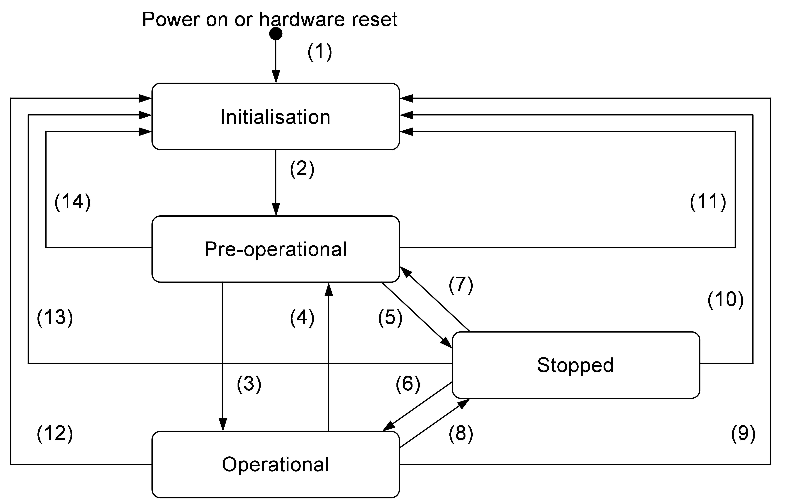
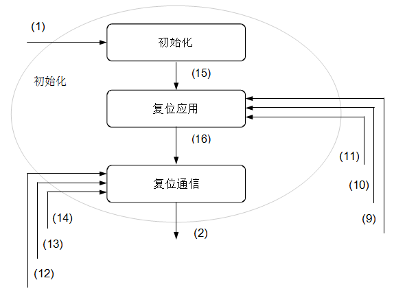

##7.3 **网络初始化和系统boot-up**
###7.3.1 **简化的NMT启动**
例如，简化的NMT启动显示于图47。该流程的定义不属于本规范的范围。  

图47：简单NMT启动
 
###7.3.2 **NMT状态机**
####7.3.2.1 **概述**
图48描述了CANopen设备的NMT状态图。CANopen设备在初始化后直接进入配置态。在这一状态可以对CANopen设备配置参数以及通过SDO服务进行CAN-ID-allocation(例如使用配置工具)。然后CANopen 设备就可以直接进入运行态。  
NMT状态机决定了通信功能单元的行为(见4.3)。CANopen设备依赖的应用状态机和NMT状态机是设备协议和应用协议的范畴。  

|(1)|上电自动进入NMT初始化态|
|---|---|
|(2)|NMT初始化执行完成——自动进入配置态|
|(3)|由NMT服务启动远程节点或由本地控制|
|(4),(7)|由NMT服务进入配置态|
|(5),(8)|由NMT服务停止远程节点|
|(6)|由NMT服务启动远程节点|
|(9),(10),(11)|由NMT服务复位远程节点|
|(12),(13),(14)|由NMT服务复位远程节点的通信|

图48：CANopen设备NMT状态图
####7.3.2.2 **NMT状态**
#####7.3.2.2.1 **NMT初始化态**
初始化态分为三个子状态(如图49)，以便能够完全或部分复位CANopen设备。  
1. **初始化**：CANopen上电或硬复位后的第一个NMT子状态。执行基本的CANopen设备初始化后自动进入复位应用子状态。
2. **复位应用**：该子状态下，制造商协议区和标准设备协议区参数被赋上电值。之后自动进入复位通信子状态。
3. **复位通信**：该子状态下，通信协议区参数被赋上电值。然后CANopen设备执行boot-up写服务并进入配置态。

上电值为最近一次存储的参数。如果设备不支持保存、保存操作未执行或复位前执行了恢复默认指令(见7.5.2.14)，上电值即为根据通信和设备协议定义的默认值。

|(1)|上电自动进入NMT初始化|
|---|---|
|(2)|NMT初始化完成——进配置态|
|(12),(13),(14)|NMT复位通讯服务|
|(9),(10),(11)|NMT复位节点服务|
|(15)|NMT初始化子状态完成–自动进入NMT复位应用子状态|
|(16)|NMT复位应用子状态完成–自动进入NMT复位通信子状态|

图49：NMT初始化状态结构
#####7.3.2.2.2 **NMT配置态**
在配置态允许SDO通信，不允许PDO通信，此状态通常用于配置PDO的参数和映射对象（PDO映射）等。  
CANopen 设备可以由NMT启动远程节点服务或通过本地控制由此状态切换至运行态。  
（~~译注：此状态直译为预操作态，但笔者认为中文没有这个词，操作运行前预热，当然叫配置态更恰当~~）
 
#####7.3.2.2.3 **NMT运行态**
此状态允许所有通信服务。传输PDOs，通过SDO访问数据字典，然而由于执行方面的问题或者是应用状态机可能要求限制对相关对象字典的访问，例如某对象可能在应用程序执行过程中不允许修改。  
（~~译注：本状态直译应为操作态，但笔者认为运行态更适合国人口味~~）
#####7.3.2.2.4 **NMT停止态**
切换CANopen设备进入NMT停止态来终止所有通信服务(除节点保护和心跳，如果被激活的话)。此外，这种状态可用于实现特定的应用行为。这种行为属于设备协议和应用协议的范畴。  
此状态下触发的EMCY消息将被挂起。在切换到其它状态后，最近的EMCY将被激活。  
注 : 错误历史记录可通过访问只读对象1003h获取。  
#####7.3.2.2.5 **NMT 状态和通信对象关系**
表37规定了状态与通信对象之间的关系。 表中的服务只在CANopen设备处在适当的状态下才能被执行。  

表37：NMT状态和通信对象关系

||配置|操作|停止|
|---|---|---|
|PDO||X||
|SDO|X|X||
|SYNC|X|X||
|TIME|X|X||
|EMCY|X|X||
|节点控制和错误控制|X|X|X|

7.3.2.3	NMT 状态转换
NMT状态转换条件
•	接到NMT节点控制服务
•	硬件复位,或
•	由设备和应用协议定义的应用事件触发的本地节点控制服务。
7.3.3	通用预定义连接集
为了减少配置工作量而定义的简单的网络CAN-ID分配方案。这些CAN-IDs将在NMT初始化态完成进入配置态后生效(如果未经修改)。对象SYNC，TIME，EMCY写和PDO在动态分配新的CAN-IDs后将被重新配置。CANopen设备应只为受支持的通信对象提供相应的CAN-IDs。
CAN-ID分配方案(定义中表38和表39)包括功能部分，它决定了对象的优先级和node-ID部分，它用于区分CANopen设备。这将允许在单一主站和多至127个从站间进行点对点通信。同时还支持无应答的NMT，SYNC和TIME广播消息。广播的node-ID为零。
 
预定义连接集支持一个应急对象、一个SDO、至多4个RPDOs、4TPDOs和NMT对象。

10	9	8	7	6	5	4	3	2	1	0

CAN-ID
功能码	节点 ID
MSB	LSB
图50：通用预定义连接集CAN-ID分配方案设置

表38和表39列出了支持的对象和访问CAN-IDs。

表38：通用预定义连接集广播对象

COB	功能码	CAN-ID
NMT	0000b	0(000H)
SYNC	0001b	128(080H)
TIME	0010b	256(100H)

表39：点对点对象的通用预定义连接设置

COB	功能码	CAN-ID
EMCY	0001b	129(081h)–255(0FFh)
PDO1(tx)	0011b	385(181h)–511(1FFh)
PDO1(rx)	0100b	513(201h)–639(27Fh)
PDO2(tx)	0101b	641(281h)–767(2FFh)
PDO2(rx)	0110b	769(301h)–895(37Fh)
PDO3(tx)	0111b	897(381h)–1023(3FFh)
PDO3(rx)	1000b	1025(401h)–1151(47Fh)
PDO4(tx)	1001b	1153(481h)–1279(4FFh)
PDO4(rx)	1010b	1281(501h)–1407(57Fh)
SDO(tx)	1011b	1409(581h)–1535(5FFh)
SDO(rx)	1100b	1537(601h)–1663(67Fh)
NMT错误控制	1110b	1793(701h)–1919(77Fh)

表39是CANopen设备视角。
即使网络支持扩展帧，通用预定义连接集也仅使用11位CAN-ID标准帧。
通用预定义连接集适用于所有的CANopen设备，并且都遵守特定的设备协议，不遵守任何应用协议。
7.3.4	特定预定义连接集
特定预定义连接集用于替换通用预定义连接集，其遵守某应用协议。特定预定义连接集不在本规范定义范围，而是由相应的应用协议定义。
 
7.3.5	受限CAN-IDs
任何列在表40的CAN-IDs使用受限。受限CAN-ID不能用于任何可配置通信对象，SYNC、TIME、EMCY、 PDO和SDO都不行。
表40：受限CAN-ID

CAN-ID	COB使用
0(000h)	NMT
1(001h)–127(07Fh)	保留
257(101h)–384(180h)	保留
1409(581h)–1535(5FFh)	默认SDO(tx)
1537(601h)–1663(67Fh)	默认SDO(rx)
1760(6E0h)–1791(6FFh)	保留
1793(701h)–1919(77Fh)	NMT错误控制
2020(780h)–2047(7FFh)	保留

